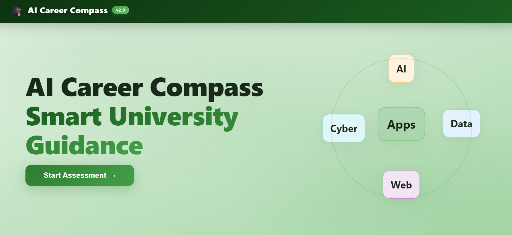

# 🎓 AI Career Compass
### AI-Powered Career Recommendation System

An intelligent web-based career recommendation system that helps university students discover the most suitable technology career path based on their skills, interests, academic performance, and study habits.

This project was developed as an AI Lab semester project using Machine Learning, Natural Language Processing (NLP), and Flask to provide personalized career recommendations and learning guidance.

---

## 📌 Overview

Choosing the right career path can be challenging for students. This application analyzes a student's profile and predicts the most suitable technology career using trained machine learning models.

The system also identifies missing skills, provides learning recommendations, and generates a downloadable PDF report for future career planning.

---

## ✨ Key Features

- Predicts suitable technology career paths using Machine Learning
- Supports both structured skill assessment and NLP-based text input
- Displays Top 3 career recommendations with confidence scores
- Performs Skill Gap Analysis
- Compares multiple Machine Learning models
- Generates downloadable PDF career reports
- Interactive charts for prediction visualization
- Clean and responsive web interface

---

## 🎯 Career Domains

The system recommends careers in:

- Artificial Intelligence
- Data Science
- Cyber Security
- Software Engineering
- Web Development
- Mobile App Development
- Cloud Computing
- Game Development

---

## 🧠 Machine Learning Models

| Model | Accuracy |
|--------|----------|
| Random Forest | **96.0%** |
| Support Vector Machine (SVM) | 93.6% |
| Logistic Regression | 92.8% |
| K-Nearest Neighbors (KNN) | 82.0% |

Random Forest achieved the highest accuracy and was selected as the final prediction model.

---

## 📝 Input Features

The prediction is based on the following student attributes:

- Math Skills
- Coding Interest
- Creativity
- Communication Skills
- Logical Thinking
- Technology Interest
- Teamwork
- Problem Solving
- GPA
- Daily Study Hours

---

## ⚡ Prediction Modes

### 1. Skill Assessment

Students select their skill levels using structured dropdown menus.

### 2. NLP Text Analysis

Students can describe themselves naturally.

Example:

> "I enjoy coding, solving logical problems, and studying Artificial Intelligence. My GPA is 3.5, and I study around 5 hours daily."

The NLP module automatically extracts useful information from the text before making predictions.

---
## 📸 Screenshots

### 🏠 Homepage



---

### 📝 Student Assessment Form


---

### 🎯 Career Prediction Results


---

### 📊 Skill Gap Analysis & Model Comparison


---

### 🛣️ Personalized Career Roadmap


---

### 📚 Recommended Learning Courses


---

### 🤖 NLP-Based Career Input


---

### 🧠 NLP Skill Extraction Analysis


---

### 📈 Model Comparison


---

### ⚙️ How It Works


---

## 🛠️ Technology Stack

### Programming Language

- Python

### Backend

- Flask

### Machine Learning

- Scikit-learn
- Random Forest
- Support Vector Machine
- Logistic Regression
- K-Nearest Neighbors

### Data Processing

- Pandas
- NumPy

### Natural Language Processing

- NLTK

### Frontend

- HTML
- CSS
- JavaScript
- Chart.js

### Report Generation

- ReportLab

### Model Serialization

- Joblib

---

## 📂 Project Structure

```
AI-Career-Compass/
│
├── app.py
├── career_model.pkl
├── scaler.pkl
├── label_encoder.pkl
├── model_stats.pkl
├── nlp_module.py
├── career_guidance_v2.ipynb
├── smart_university_guidance_dataset.csv
├── requirements.txt
├── README.md
│
├── templates/
│   └── index.html
│
├── static/
│   ├── css/
│   │   └── style.css
│   ├── js/
│   │   └── main.js
│   └── images/
│
└── images/
    ├── Homepage.png
    ├── Student Assessment Form.png
    ├── Career Prediction Results.png
    ├── Skill Gap Analysis & Model Comparison.png
    ├── Personalized Career Roadmap.png
    ├── Recommended Learning Courses.png
    ├── NLP-Based Career Input.png
    ├── NLP Skill Extraction Analysis.png
    ├── Model Comparison.png
    └── How it works.png
```

---

## ⚙️ Installation

### 1. Clone the Repository

```bash
git clone https://github.com/sobia-11/AI-Career-Compass.git
```

### 2. Navigate to the Project

```bash
cd AI-Career-Compass
```

### 3. Create a Virtual Environment

Windows

```bash
python -m venv venv
venv\Scripts\activate
```

Linux / macOS

```bash
python3 -m venv venv
source venv/bin/activate
```

### 4. Install Dependencies

```bash
pip install -r requirements.txt
```

### 5. Run the Application

```bash
python app.py
```

### 6. Open in Browser

```
http://127.0.0.1:5000
```

---

## 📊 Dataset

The project uses a custom dataset containing student academic and skill-related information.

Dataset includes:

- GPA
- Study Hours
- Coding Interest
- Mathematical Skills
- Creativity
- Teamwork
- Communication Skills
- Logical Thinking
- Technology Interest
- Problem Solving

The target variable consists of eight technology career categories.

---

## 📈 Future Improvements

Future versions of this project may include:

- User Login and Authentication
- Resume Analysis
- AI Chatbot Career Assistant
- Online Course Recommendations
- Career Roadmap Generator
- Cloud Deployment
- Mobile Application
- Real-time Industry Trend Analysis

---

## 👩‍💻 Author

**Sobia Shaheen**

BS Artificial Intelligence Student

Institute of Space Technology (IST), Islamabad

GitHub:
https://github.com/sobia-11

LinkedIn:
https://linkedin.com/in/sobia-shaheen01

Email:
sobiashaheen1039@gmail.com

---

## 📄 License

This project was developed for educational and learning purposes as part of an Artificial Intelligence Lab semester project.
